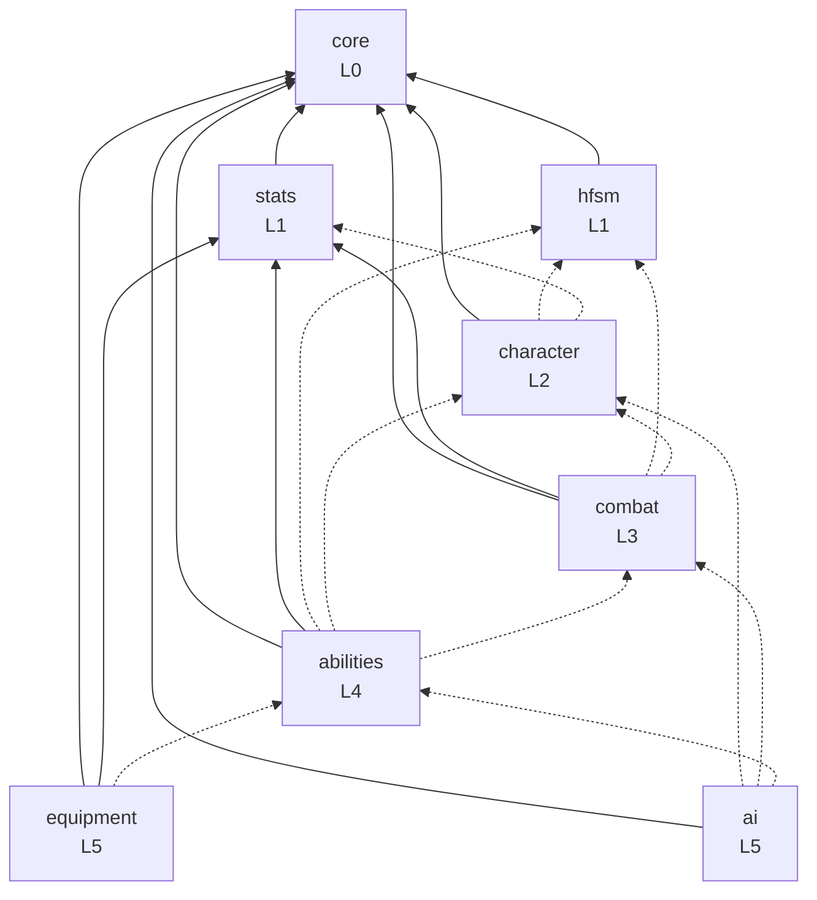

# 01 — Dependency Graph oficial

> Fonte de máquina: [`dependency-graph.json`](../dependency-graph.json), validada por
> `tools/check_dependencies.py`. Alterar o grafo exige ADR.
> Cada package tem `status`: `planned` (pode estar ausente) ou `implemented` (precisa existir em `Packages/` e é
> sempre verificado). `tools/new_package.py` muda o status para `implemented` ao gerar o package.

## Dois tipos de dependência

| Tipo | Como é declarada | Significado |
|---|---|---|
| **Hard** | `package.json` → `dependencies` + referência na asmdef `Runtime` | O package não funciona sem a dependência. |
| **Optional (integração)** | asmdef própria em `Runtime/Integration/<Outro>/` com `defineConstraints` + `versionDefines` | Código de adapter que só compila se o outro package estiver instalado. O package funciona sem ele. Ver [ADR-0002](adr/0002-optional-integration-assemblies.md). |

## Grafo

Linha cheia = hard. Linha tracejada = integração opcional. Setas apontam para quem é *conhecido*.

## Matriz

| Package | Camada | Hard | Optional (integration assemblies) | Externos opcionais |
|---|---|---|---|---|
| `core` | L0 | — | — | — |
| `stats` | L1 | core | — | — |
| `hfsm` | L1 | core | — | — |
| `character` | L2 | core | hfsm, stats | com.unity.inputsystem |
| `combat` | L3 | core, stats | hfsm, character | com.unity.inputsystem |
| `abilities` | L4 | core, stats | hfsm, character, combat | com.unity.inputsystem |
| `ai` | L5 | core | character, combat, abilities | — |
| `equipment` | L5 | core, stats | abilities | — |

## Regras

1. **Camadas estritas:** um package só conhece packages de camada **inferior**. Isso torna ciclos impossíveis.
2. O adapter vive **no package de camada superior** (quem conhece os dois lados).
   Ex.: knockback de Combat no motor de Character → `RamiresTechGames.Combat.Integration.Character`.
3. Fluxo "para cima" (camada inferior precisa reagir a uma superior) é feito por **pontos de extensão**:
   a camada inferior define a interface, a superior implementa.
   Ex.: Combat define `IHitEffect`; Abilities implementa `ApplyGameplayEffectOnHit` em sua integração com Combat.
4. Nenhum package conhece WOR ou qualquer jogo consumidor.
5. `ai` não depende de `hfsm`: a BT escreve intenções nos *command buffers* de Character/Combat/Abilities;
   a HFSM do personagem as executa. **Behaviour Tree decide; HFSM executa.** Ver [ADR-0004](adr/0004-command-buffers.md).

## Por que essas dependências hard

| Dependência | Justificativa |
|---|---|
| `* → core` | Core contém só o mínimo transversal (ordem de execução, validação, futuramente tags). Estável e pequeno. |
| `combat → stats` | Resolução de dano precisa de atributos do atacante/defensor e de um recurso de vida. Modelar isso com adapters opcionais duplicaria o Stats dentro do Combat. |
| `abilities → stats` | Custos, recursos e Gameplay Effects são, por definição, operações sobre atributos. |
| `equipment → stats` | Modificadores de atributos são a função central de um equipamento. |

## Por que essas dependências **não** são hard

| Não-dependência | Motivo |
|---|---|
| `combat ↛ character` | Alvos de combate podem ser objetos sem motor (caixas, torretas). Combat define `IKnockbackReceiver` e tem receptor padrão para `Rigidbody`. |
| `combat ↛ hfsm` | O combo runner é uma classe pura; pode ser tickado por um componente simples ou por um estado da HFSM. |
| `abilities ↛ combat` | Muitas abilities não são ataques (buffs, cura, movimento). |
| `ai ↛ hfsm` | BT não comanda estados diretamente; produz intenções. |
| `equipment ↛ abilities` | Equipamentos com apenas modificadores de stats são o caso comum. |
| `character ↛ stats` | Motor funciona com valores do `MovementProfile`; integração com Stats é opcional (ex.: velocidade derivada de Agility). |
