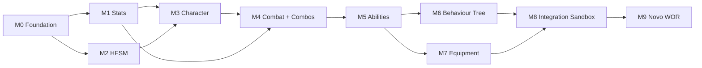

# 07 — Roadmap

## Quality Gates

Um sistema está **pronto** somente quando todos os itens abaixo passam:

| # | Gate | Como verificar |
|---|---|---|
| QG1 | Compila em Unity **6000.6.5f1** sem erros e sem warnings novos | `unity command recompile` + `console_status` no host |
| QG2 | Funciona sem qualquer jogo consumidor (WOR incluso) | `check_dependencies.py` (sem referência a assemblies do jogo) + testes do package sem cenas/assets do jogo |
| QG3 | Testes de domínio e integração adequados, verdes | `run_tests` (ver [05](05-testing-strategy.md)) |
| QG4 | Sample funcional importável pelo Package Manager | Importar sample no host, validar e remover |
| QG5 | Documentação atualizada (README, CLAUDE, ARCHITECTURE, CONTRACTS, TESTING, ROADMAP, CHANGELOG) | Revisão |
| QG6 | API pública compreensível e listada em CONTRACTS.md com estabilidade | Revisão |
| QG7 | Editor UX adequada (Inspectors com Header/Tooltip, menus de criação, ferramentas visuais necessárias) | Revisão no Editor |
| QG8 | Validações de configuração (IValidatable + OnValidate) | Validator sem falsos negativos nos testes |
| QG9 | Debug apropriado (runtime inspector/debugger/gizmos) | Revisão em Play Mode |
| QG10 | Sem dependências circulares / fora do grafo; todos os packages esperados verificados | `python Docs/Framework/tools/check_dependencies.py --package <id>` (+ `python -m unittest discover -s Docs/Framework/tools/tests` quando a ferramenta mudar) |
| QG11 | Casos de uso comuns sem editar o código do package | Sample montado só com Inspector |
| QG12 | **Instalação isolada:** o package e somente suas dependências obrigatórias instalam, compilam sem erros/warnings e passam nos testes em um projeto Unity mínimo e descartável, sem código ou assets do WOR | `python Docs/Framework/tools/verify_isolated_install.py <id>` (cria o projeto temporário, roda EditMode/PlayMode em batchmode e apaga) |

## Milestones

**Estado:** M0 ✅ (Core `v0.1.0`) · **M1 ✅ concluído em 2026-10-09** (Core `v0.2.0` @`d679181`, Stats `v0.1.0` @`cfc42db`) ·
**M2 ✅ concluído em 2026-10-10** (Core `v0.3.0` @`197dcd6`, HFSM `v0.1.0` @`903aae9`; Stats segue `v0.1.0`) ·
**M3 (Character Controller) — design em revisão** (`design/m3-character-design.md`, ADRs 0010–0012 propostos); implementação só após aprovação.

M1 e M2 são independentes entre si (podem ser feitos em qualquer ordem). M3 depende dos dois apenas
para os integration assemblies opcionais.

| Milestone | Depende de | Entregas | Critérios de aprovação (além dos QGs) |
|---|---|---|---|
| **M0 Foundation** | — | Dependency graph, contratos, convenções, template, ferramentas, Core 0.1.0 (ExecutionOrder + Validator), Integration Sandbox em `Assets/_FrameworkSandbox` do host | Template gera package que compila e passa testes no host; `check_dependencies` verde; revisão de arquitetura aprovada pelo owner. |
| **M1 Stats** | M0 | Stat/Resource/StatSet definitions, modificadores, derivadas, regen/consumo, eventos, Runtime Stat Inspector | Fórmula de modificadores em ADR; recálculo de derivadas ordenado e sem ciclo (validator detecta ciclo); tick sem GC; sample "Stats Playground". |
| **M2 HFSM** | M0 | Definição de grafo, estados SR, guards, prioridade/interrupção, contexto, runner, visualização e debugger | **Spike de tecnologia de graph editor** (Graph Toolkit × GraphView × UI Toolkit próprio) com ADR, reaproveitável em M4/M6; sample com estados compartilhados por 2 atores. |
| **M3 Character** | M0 (+M1/M2 opcionais) | Motor, profile, pulo exato/variável, coyote, buffer, air control, dash, forças externas, facing, chão; integrações HFSM/Stats/InputSystem | Teste PlayMode: altura do pulo dentro de tolerância; mesmo prefab controlado por Player e por script de comandos; funciona com sprite e com modelo 3D. |
| **M4 Combat + Combos** | M1 (+M2/M3 opcionais) | **Estudo de design de combate** (documento; BeatEmUpTemplate2D só como inspiração de mecânicas), Attack/Combo definitions, HitBox/HurtBox 3D, resolução de dano, defesa, parry, stun, knockback/launch/knockdown, grab/throw, multi-target, Combo Graph Editor, debugger | Estudo de design aprovado antes de codar; os 6 `HitOutcome` cobertos por testes; mesmo sistema para Player e Enemy; nenhum código de terceiros copiado; GameplayTags entram no Core (ADR) se necessárias. |
| **M5 Abilities** | M1, M4 (opcional) | Abilities ativas/passivas, effects, tags, custos, cooldowns, targeting, stacking, cancelamento, concessão, composição, debugger | Composição de 2 abilities sem código novo; adapter Combat via `IHitEffect`; nenhum nome de jogo no código. |
| **M6 Behaviour Tree** | M3, M4, M5 (opcionais) | BT, Blackboard, composites, decorators, sensores, interrupções, target selection, graph editor, debugger | Inimigo de exemplo faz Patrol/Chase/Attack/Retreat só com assets; nenhuma chamada direta a motor/combat fora dos adapters. |
| **M7 Equipment** | M1, M5 (opcional) | Slots, restrições, equip/unequip, modificadores, ability grants, passivos, loadouts, editor | Equipar/desequipar restaura stats exatamente (teste); grants revogados ao desequipar. |
| **M8 Integration Sandbox** | M1–M7 | Cena `Assets/_FrameworkSandbox/Scenes/Sandbox_Main` com Player + AI usando todos os packages; testes cross-package; perf básica | 60 FPS com N atores definidos no ADR de perf; zero GC por frame no loop de simulação. O M8 é gate de integração: **não** promove versões automaticamente; cada package chega a 1.0.0 pelos critérios próprios de [06](06-versioning-and-publishing.md#critérios-para-100). |
| **M9 Novo WOR** | M8 | Montagem do novo WOR do zero sobre o projeto base `Projetos/Whisker Of Rage` (repo `Whisker-Of-Rage-Unity-6`, Unity 6000.6.5f1): packages como submodules em `Packages/`, prefabs, conteúdo e glue do jogo | Nenhum código do WOR antigo; nenhuma alteração em código de package para montar o jogo (somente issues/PRs nos repos de package). |

## Revisão de arquitetura

Ao fim de cada milestone: atualizar este roadmap, `COMPATIBILITY.md`, e abrir ADR para qualquer desvio
do [grafo](01-dependency-graph.md) ou dos [contratos](02-package-boundaries-and-contracts.md).
